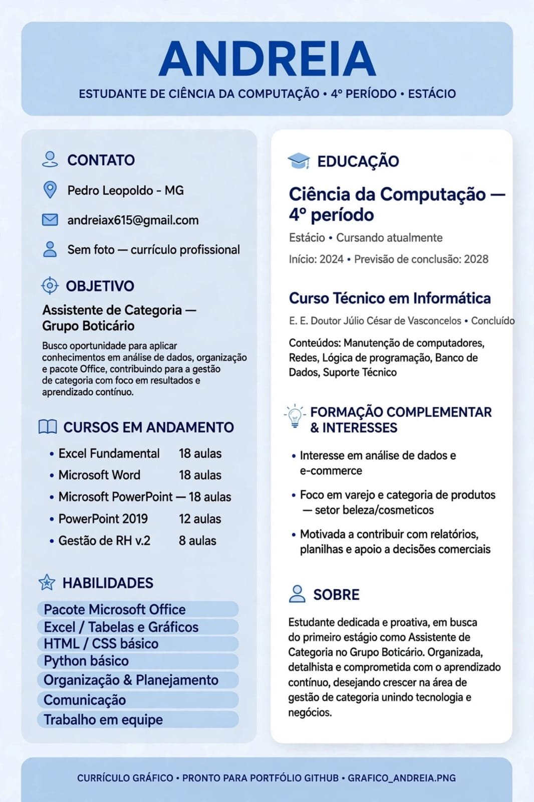

# Portfólio de Dados - Andreia | Assistente de Categorias - Grupo Boticário

Olá! Sou Andreia, de Pedro Leopoldo - MG.
Cursando Ciência da Computação 4º período (Estácio) | Técnico em Informática | Excel, Word, PowerPoint - Treinapel

Busco vaga como Assistente de Categorias no Grupo Boticário.

### Projeto 1: Super Trunfo Cidades - Análise por Categoria
Link: https://github.com/Cursos-TI/desafio-cadastro-das-cartas-no-super-trunfo-Andreia-ui

| Estado | Código | Cidade | População | Área | PIB | Pontos |
| :--- | :--- | :--- | :--- | :--- | :--- | :--- |
| A | A01 | São Paulo | 12.3M | 1521 | 700B | 50 |
| A | A02 | Rio de Janeiro | 6.7M | 1200 | 300B | 42 |
| B | B01 | Brasília | 3.0M | 5760 | 250B | 30 |
| B | B02 | Salvador | 2.9M | 693 | 62B | 35 |

### Projeto 2: Análise de Valor em Estoque por Categoria
Gráfico criado no Excel - Curso Excel Fundamental Treinapel.
Análise para controle de estoque e tomada de decisão por categoria, essencial para Assistente de Categorias.

*Insight: Categoria C representa maior valor em estoque (R$ 2260), requer atenção para giro. Categoria B tem menor valor (R$ 540).*

### Tecnologias
Excel | Word | PowerPoint | Análise por Categoria | Linguagem C | GitHub

### Contato
📞 31 99099-53681
📧 andreiax615@gmail.com
📍 Pedro Leopoldo, Minas Gerais
